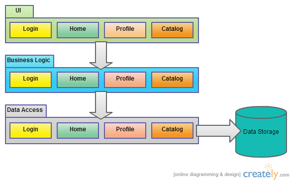

# Architectural Goal

In this book / course, we will build a distributed platform for real open source project called OpenEpi. The architecture will culminate in a web site / mobile app, and command-line interface which allows for users to execute mathematical and statistical commands related to epidemiology and public health. OpenEpi was originally founded by Dr. Andrew Dean, an epidemiologist who worked at the United States Centers for Disease Control and Prevention and managed the team that built the now open-source Epi-Info project.

Our architecture will allow modules written in the following languages to execute in a cohensive, "polyglot" architecture:

- JavaScript - (Client, and server via Node.js)
- CoffeeScript - (Client, and server via Node.js)
- R - a language popular in the public health and statistics communities
- C# - (Server)
- F# - (Server, client-side via transpilation)
- Any other language that can be transpiled to JavaScript - (Client0
- Any other language that can run on a web site or cloud host - such as PHP, Python,
Java, PERL, R, etc

## Additional goals

Though not a direct consequence of the architecture we will build, we will also demonstrate distributed, multi-node processing with the new Hadoop support in Windows Azure.

The resulting application will serve as a strong foundation for the future of the OpenEpi project, but can also be used freely by you and your teams and projects for building your own architecturally polyglot applications.

# Bubbling up order from a frothy sea of chaos

> ***If you hit the Amazon.com gateway page, the application calls more than 100 services to collect data and construct the page for you.*** -- Werner Vogels, Amazon.com CTO on the foundations of the Amazon.com architecture, [ACM Queue](http://queue.acm.org/detail.cfm?id=1142065)

You might think it requires a high degree of corporate discipline for Amazon to keep all those 100 services written in a consistent, corporate-policy and standards compliant fashion. Well, it would, but that's not now Amazon.com is built. As Vogels also says in the interview:

> From the outside, the services in our platform may appear chaotic, but chaotic in a good sense—in that we try not to impose a rigid structure on the different functional pieces, but we expect there to be order when looking at it from a different dimension. Thinking about this whole system as a big deterministic system would be unrealistic. Life is not deterministic, and a large-scale distributed system such as Amazon has many organic and emerging properties that can come to life only if you do not constrain it.

# Reckoning with the Forces of Modularity and Monolithity

Before we get into conceptual detail on topics like Test-Driven Development, Behavior-Driven Development, continuous integration and deployment, cloud-hosted services, 
or any of the ideas from Domain-Driven Design and the "new hotness", Command and Query Responsibility Segregation (CQRS), we need some lessons on the beauty of **modularity** and its evil, vile doppleganger **monolithity**.

While we can apply these concepts to different aspects of a system, we will be discussing, primarily the packaging and deployment of a system's features or capabilities 

## Modularity: breaking a system down into smaller, more manageable parts

To start, here's a great definition of a [modular programming](http://en.wikipedia.org/wiki/Modular_programming) 
comes from Wikipedia:

> Modular programming (also called "top-down design" and "stepwise refinement") is a software design technique
> that emphasizes separating the functionality of a program into independent, interchangeable modules,
> such that each contains everything necessary to execute only one aspect of the desired functionality.
> Conceptually, modules represent a separation of concerns, and improve maintainability by enforcing logical
> boundaries between components. Modules are typically incorporated into the program through interfaces.
> A module interface expresses the elements that are provided and required by the module.
> The elements defined in the interface are detectable by other modules. The implementation contains the
> working code that corresponds to the elements declared in the interface.

With this in mind, think of `modularity` as the relative degree to which the complete system exhibits these properties. Here's the Wikipedia definition of modular software design:

> In software design, modularity refers to a logical partitioning of the "software design" that allows complex software to be manageable for the purpose of implementation and maintenance. The logic of partitioning may be based on related functions, implementation considerations, data links, or other criteria.
> 

These are great working definitions for modular design! Although there is a lot to consider, we will break it down by using example code very soon. 

## Monolithity: the degree to which a software system is deployed or managed as a single package ??

The original definition of a monolith is:

> A monolith is a geological feature consisting of a single massive stone or rock, such as some mountains, or a single large piece of rock placed as, or within, a monument or building.

For us, this evokes the vision of large, immovable peice of code or, indeed, an entire system whose architecture, piled high and wide like a mountain, makes it difficult or impossible to scale.

More formally, Wikipedia defines a [monolithic system](http://en.wikipedia.org/wiki/Monolithic_system) like this:

> A software system is called "monolithic" if it has a monolithic architecture, in which functionally 
> distinguishable aspects (for example data input and output, data processing, error handling, and the user 
> interface), are not architecturally separate components but are all interwoven.

## 

Here's a typical depiction of what a monolithic application looks like at the package level. Typically, each of the 
horizontal packages depicted here would be compiled into a DLL, resulting in 3 separate DLLs. Some people will say 
that this is "good design", and is based on the standard [three-tier architecture](http://en.wikipedia.org/wiki/Multitier_architecture) pattern.



It's not that this architecture is inherently monolithic or monstrous, but when implemented a certain way, it leads to improper class packaging, resulting in violations of at least one of the package principles, the [Common-Closure Principle](http://en.wikipedia.org/wiki/Package_Principles), which states:

> This states that the package should not have more than one reason to change. If change were to happen in an application dependent on a number of packages, ideally we only want changes to occur in one package, rather than in a number of them.
> 
> This helps us determine classes that are likely to change and package them together for the same reasons. If the classes are tightly coupled, put them in the same package.

In our diagram above, each layer package contains classes that are not related to each other, yet they are co-located in the same physical package. The first, and most important language with regard to OpenEpi, that we will examine is JavaScript. While the situation has vastly improved with today's modern JavaScript libraries and frameworks, it's still not uncommon to see web applications that have all JavaScript functions and object prototypes defined in a single or a handful of "top-level" scripts that get included inn a common template or master page. No matter how many forms or other link navigations a user performs, that script is always there, and its functions are ready to execute when a new page loads.

In practice, it is not at all uncommon to encounter code in the wild that does the following:

TODO: rework this with HTML simply:

1. Inherits `System.Web.Ui.Page` or `System.Web.Mvc.Controller` and an event-handler or action handler:
2. Instantiates an instance of a business layer class, like `User` or `Product` and sets a bunch of instance properties, like `FirstName`, `LastName`, `PhoneNumber`, or the like.
3. Calls a method on the `User` instance, such as `Save()`	
4. The `Save()` method internally instantiates a data access class, which executes a stored procedure on a database.

## Exercise 01: Monolithic Calculator TODO fix this

To begin to understand the problems we face by large, monolithic scripts, let's build the simple and canonical calculator example using JavaScript. We start with a [Mocha framework](http://visionmedia.github.com/mocha/) BDD-style unit test that defines the behavior we want for an object named `Calculator` which has an `add` function that can take an arbitrary number of numeric parameters and add them together. It also defines a test for a similar function named `subtract` which starts with the first argument passed, then subtracts all additional arguments from that to arrive at a final answer.

### Exercise 01.01 Code

You can download the sample code for this project and open the exercise TODO in the chapter 1 folder, or you can [execute it online with JSFiddle](http://jsfiddle.net/JoshGough/xbe5c/).

```javascript
function Calculator() {
    this.add = function () {
        var result = 0;
        for (var i = 0, j = arguments.length; i < j; i++) {
            result += parseFloat(arguments[i]);
        }
        return result;
    };
    this.subtract = function () {
        var result = 0;
        if (arguments.length > 0) result = arguments[0];
        for (var i = 1, j = arguments.length; i < j; i++) {
            result -= parseFloat(arguments[i]);
        }
        return result;
    };
}

mocha.setup('bdd');

describe("Calculator", function () {
    describe("when add called with 2 and 2 and 7", function () {
        it('returns 11', function () {
            var calc = new Calculator();
            var result = calc.add(2, 2, 7);
            expect(result).to.be(11);
        });
    });

    describe("when subtract called with 11 and 2 and 2", function () {
        it('returns 7', function () {
            var calc = new Calculator();
            var result = calc.subtract(11, 2, 2);
            expect(result).to.be(7);
        });
    });
});

mocha.run();
```

### Exercise 01.01 Expected Output

```text
Calculator
	when Add called with 2 and 2 and 7
		returns 11
	when subtract called with 11 and 2 and 2
		returns 7
```
'''
'''

## Separating functionality of a program into independent, interchangeable modules

This is all simple enough. And, you might say that we could add all sorts of mathematical functions to this `Calculator` constructor function and 
end up with something like the calculator you have on your iPhone or Android, 
or the one built into your operating system. We could add methods for `multiply`, `divide`, `power`, etc.

## Adding too many methods will lead to a monolithic, beastly application

But, there are already some problems with using JavaScript to design constructor functions in this fashion, and these problems would balloon behind our ability 
to manage if we hope to build large-scale systems that require a large amount of JavaScript code to run inn front-end web clients, or on servers with Node.js, for example. 

### Inefficient use of JavaScript

To start, we are not really using JavaScript's capabilities to the maximum the 
way this code is written. Listing TODO presents a refactored version that demonstrates better JavaScript ninjery. [Forkable Live Example](http://jsfiddle.net/JoshGough/tR6F7/).


### Exercise TODO Code

```javascript
function Calculator() {
}

Calculator.prototype.add = function () {
    var result = 0;
    for (var i = 0, j = arguments.length; i < j; i++) {
        result += parseFloat(arguments[i]);
    }
    return result;
};

Calculator.prototype.subtract = function () {
    var result = 0;
    if (arguments.length > 0) result = arguments[0];
    for (var i = 1, j = arguments.length; i < j; i++) {
        result -= parseFloat(arguments[i]);
    }
    return result;
};

mocha.setup('bdd');

describe("Calculator", function () {
    describe("when add called with 2 and 2 and 7", function () {
        it('returns 11', function () {
            var calc = new Calculator();
            var result = calc.add(2, 2, 7);
            expect(result).to.be(11);
        });
    });

    describe("when subtract called with 11 and 2 and 2", function () {
        it('returns 7', function () {
            var calc = new Calculator();
            var result = calc.subtract(11, 2, 2);
            expect(result).to.be(7);
        });
    });
});

mocha.run();
```
### Exercise TODO explanation

It might seem odd that the `Calculator` constructor function is now blank, but the reason is that we're now using the special `prototype` property of the function itself. This, effectively, achieves the goal of providing inheritance for all instances created by calling `new Calculator()`. 

### Note:
> Since this book's goal is not to teach you the fine-grained details about the JavaScript language, I refer you to the resources at the end of this chapter to learn more about patterns of object-oriented JavaScript development.

### Unnecessary coupling

Another issue you may have spotted is that the `Calculator` class has too many 
responsibilities. Is it really its business to implement all the details of each mathematical operation? I would argue that it should serve as more of a simple 
gateway, or facade, to a collection of operations.

The `add` and `subtract` operations are logically distinct, and neither one needs the other. Thus, they can be created, and tested, independently. And, they can even be delivered to a client application as discrete modules.

### Adding more people to a project can help complete it faster

Programmers often pontificate about **loose coupling**, even to the point of being pedantic and religious about it from the point of view of managers who may be laboring to deliver a complete, cohesive solution to attain a business goal by a deadline. Hoping to meet a date, managers often employ the **let's add more people to the project to make it go faster** technique. While this approach is much-maligned by programmers and many managers alike, partly because of Fred Brooks' book The Mythical Man Month, there are ways you can add **more resources** to a project to finish it faster and with the same, or higher, quality. You achieve this by carefully designing the system's integration strategy correctly!

### Enable multiple developers or multiple teams to deliver a project more quickly and with higher quality with proper loose coupling, modularity, and packaging

Suppose our calculator had more sophisticated mathematical operations to implement, such as scientific algorithms or statistical functions? Actually, you won't have to suppose for long. That is precicely what OpenEpi is! And, what if you had more than one person working on the system? That's almost a foregone 
conclusion for any system of appreciable size and importance. What we need now is to actually achieve the `independent, interchangeable modules` part of the **modular programming** definition from above. Let's do that.

### Approaches to modular development in JavaScript

Innovative JavaScript developers have created multiple ways to solve the modularity goal for JavaScript. So, eventually we will look at approaches like jQuery Plugins, RequireJS, CommonJS, and the Asynchronous Module Definition pattern. But, first let's just modularize our `Calculator` by hand by rolling a technique that is similar to how jQuery Plugins work.

# Modules are typically incorporated into the program through interfaces

To achieve `independdent, interchangeable modules`, we will incorporate another part of the definition, where it 
states `Modules are typically incorporated into the program through interfaces`.

Do you seem something in common for both the `add` and `subtract` functions? Remember that in each case, we simply iterate over the special `arguments` object, which represents the parameters passed into a JavaScript function. We expect that each of those arguments can be parsed into floating point numbers.

## Define an idiomatic interface to encapsulate mathematical operations

When we talk about mathematics, we usually refer to signs like `+`, `-`, `/`, and `*` as operators, or operations.

In JavaScript, we do not have the formal concept of an interface, like we do in 
languages like C# or Java.

In C#, we could create an explicit interface to represent an object with one method, `Execute`, that accepts a variable-length array of decimal arguments

```csharp
public interface IOperation
{
  object Execute(params decimal[] args);
}
```

Then, we could create various classes that implement the `IOperation` interface. Recall the definition of a module again when it says: 
`The implementation contains the working code that corresponds to the elements declared in the interface`.

## Listing TODO C# interface-based calculator

```csharp
using NUnit.Framework;
using System;

namespace InterfaceBasedCalculator
{
  	[TestFixture()]
	public class InterfaceBasedCalculatorTests
	{
		private Calculator _subject = new Calculator();
		
		[Test()]
		public void add_sums_three_numbers()
		{
			var result = _subject.Add (5.5M, 6M, 7M);
			
			Assert.AreEqual (18.5, result);
		}
		
		[Test()]
		public void subtract_removes_two_numbers_from_first()
		{
			var result = _subject.Subtract (10M, 5M, 3M);
			
			Assert.AreEqual (2M, result);
		}
	}

	public interface IOperation
	{
		decimal Execute(params decimal[] args);
	}

	public class Add : IOperation {
		public decimal Execute(params decimal[] args) {
			decimal result = 0M;
			for(var i = 0; i < args.Length; i++) {
				result += args[i];
			}
			return result;
		}
	}

	public class Subtract : IOperation {
		public decimal Execute(params decimal[] args) {
			decimal result = 0M;
			if (args.Length > 0)
			{
				result = args[0];
				if (args.Length > 1) {
					for(var i = 1; i < args.Length; i++) {
						result = result - args[i];
					}
				}
			}
			return result;
		}
	}

	public class Calculator 
	{
		public decimal Add(params decimal[] args) 
		{
			return new Add().Execute (args);
		}

		public decimal Subtract(params decimal[] args)
		{
			return new Subtract().Execute (args);
		}
	}
}
```

# Modular JavaScript calculator

Thankfully, our task is far simpler in JavaScript because of its dynamic nature. In the coming chapters, we will walk through the implementation of several of the OpenEpi.com calculation modules. But, for the rest of this chapter, we'll stick with simple and familiar mathematics operations.

Here are several progressively more useful ways to achieve modularity with JavaScript files that we'll examine:

1. Manually include references to separate operation scripts, each of which augment the `Calculator` constructor function with new functionality.
2. Build a remote service with Node.js to return a list of all available operation script files, and load them all sequentially.
3. Refactor the remote service to bundle all available operations into a single file to reduce download time.
4. Use RequireJS to load files that support the Asynchronous Module Definition pattern, and to wrap others that don't.

# Manually include separate scripts that build up the prototype

Live Fiddle: http://jsfiddle.net/JoshGough/32VPF/

Suppose you create the `Calculator` constructor in one file, `Calculator.js` and then you want multiple, possibly distributed team-members to be able to independently add new operations to it, and without any risk of clobbering other's work. You could, quite simply separate files for each operation which augment the prototype, and manually include those files into the hosting HTML page. Here's an example:

## Listing TODO Calculator.js

```javascript
function Calculator() {
}
```

## Listing TODO modules\add.js

```javascript
Calculator.prototype.add = function () {
    var result = 0;
    for (var i = 0, j = arguments.length; i < j; i++) {
        result += parseFloat(arguments[i]);
    }
    return result;
};
```

## Listing TODO modules\subtract.js

```javascript
Calculator.prototype.subtract = function () {
    var result = 0;
    if (arguments.length > 0) result = arguments[0];
    for (var i = 1, j = arguments.length; i < j; i++) {
        result -= parseFloat(arguments[i]);
    }
    return result;
};
```

## Listing TODO calculator.html

```html

<html>
<head>
    <title>Calculator - File Based Extensibility</title>        
    <script src="https://gist.github.com/JogoShugh/5275545/raw/747581724f7306851e221f9f5b8792f09073710d/calcultor.js" language="javascript"></script>
    <script src="https://gist.github.com/JogoShugh/5275545/raw/4b928cb9031deb4036ea590e02e795ac3f4b569b/add.js" language="javascript"></script>
    <script src="https://gist.github.com/JogoShugh/5275545/raw/1a4a0f23da0c60f2b5359078d6bbd9254e629436/subtract.js" language="javascript"></script>
    <script language="javascript">
        $(function() {
            var calc = new Calculator();
            var output = $("#output");
            output.append(calc.add(1,2,3) + "<br/>");
            output.append(calc.subtract(10,5,1) + "<br/>");
            output.append(calc.subtract(calc.add(10,9,8), 5, 3) + "<br/>");
        });
    </script>
</head>
<body>
    <div id="output"></div>    
</body>
</html>
```

## Explanation of Calculator with file-based extensibility

This example is very straight-forward. The `Calculator.js` file does nothing more than declare a top-level, empty constructor function. Its sole purpose is to serve as a container for its own prototype, to which we will later attach additional functions to implement the various operations we want to support.

In the `add.js` and `subtract.js` files, we placed the respective functions for those operations, augmenting the `Calculator.prototype` object as just described.

Finally, the HTML file, `calculator.html` sets references to each script, making sure that `Calculator.js` gets specified first. Then, in the in-line script, it uses jQuery's `$(function(){...})` helper to set up a function to load once the page's DOM and resources are fully loaded. At this point, all the scripts are loaded, and our `Calculator`, once so bare and lonely, has both the `add` and `subtract` functions attached to its prototype. 

Visit this [JS Fiddle](http://jsfiddle.net/JoshGough/32VPF/) to run it now live. The output should be **6, 4, and 19**.

Or, to run this on your own machine with Node.js, you can use the following files:

TODO create repo for this

## index.html

```html
<html>
<head>
    <title>Calculator - File Based Extensibility</title>
    <script src="http://code.jquery.com/jquery-1.9.1.min.js"></script>    
    <script src="calculator.js" language="javascript"></script>
    <script src="modules/add.js" language="javascript"></script>
    <script src="modules/subtract.js" language="javascript"></script>
    <script language="javascript">
        $(function() {
            var calc = new Calculator();
            var output = $("#output");
            output.append(calc.add(1,2,3) + "<br/>");
            output.append(calc.subtract(10,5,1) + "<br/>");
            output.append(calc.subtract(calc.add(10,9,8), 5, 3) + "<br/>");
        });
    </script>
</head>
<body>
    <div id="output"></div>    
</body>
</html>

```

## server.js 

```javascript
var express = require("express"),
    app     = express(),
    port    = parseInt(process.env.PORT, 10) || 4567;
    
app.get("/", function(req, res) {
  res.redirect("/index.html");
});

app.configure(function(){
  app.use(express.methodOverride());
  app.use(express.bodyParser());
  app.use(express.static(__dirname + '/public'));
  app.use(express.errorHandler({
    dumpExceptions: true, 
    showStack: true
  }));
  app.use(app.router);
});

app.listen(port);
```
## Running the server with Node.js

To run this:

* Install Node.js from its web site for your operating system
* Type `npm install express`
* Type `node server.js &`
* Navigate to `http://localhost:4567`

## Benefits of file-based extensibility

Here are some strong points of this approach:

* It increases our ability to add many new operations to the calculator while 
reducing the risk of the operations, and their respective authors, from conflicting with each other
* By separating each operation into discrete files, it supports the TODO separation-of-concerns maxim

## Drawbacks of this particular approach

While these benefits are worth having now and in the future, there's still a problem with this simplistic approach. Most glaringly, even if we add a new operation, like `multiply` to the modules folder, we still need to modify the `index.html` file to manually reference that module. This makes the job of deployment and management more difficult.

More technically this violates the Open/Closed Principle of object-oriented programming. Originally formulated by Betrand Meyer, this principle states: 

> software entities (classes, modules, functions, etc.) should be open for extension, but closed for modification

Aren't we somewhat supporting this, however? After all, we are extending `Calculator` by adding code, rather than modifying code. While this is true, we have just pushed the problem upward in the chain of execution, all the way up to the client code, our HTML page itself.

Let's address this in our next iteration by refactoring our code.

# Build a remote service with Node.js to return a list of all available operation script files, and load them all sequentially.

Let's modify the `server.js` file so that we can query for a list of operations. You can modify your existing code or copy and paste the entire folder first.

## Add a new route to get a list of operations

The new route `/calculator/operations` will return an array of file names corresponding to each file within the `public/modules` folder.

```javascript
var express = require("express"),
    app     = express(),
    port    = parseInt(process.env.PORT, 10) || 4567,
    fs      = require("fs");
    
app.get("/", function(req, res) {
  res.redirect("/index.html");
});

app.get("/calculator/operations", function(req, res) {
  var files = fs.readdirSync(__dirname + '/public/modules');
  res.send(files);
});

app.configure(function(){
  app.use(express.methodOverride());
  app.use(express.bodyParser());
  app.use(express.static(__dirname + '/public'));
  app.use(express.errorHandler({
    dumpExceptions: true, 
    showStack: true
  }));
  app.use(app.router);
});

app.listen(port);

```

## Use jQuery's $.getScript to dynamically load the operations

While we soon examine much easier ways to achieve this with open source libraries like RequireJS very soon, we need to first understand the concepts.

TODO better description

Here's a new version of `index.html` that will query the new `/calculator/operations` we just defined, and then use jQuery's `$.getScript` function to load and execute it. This successfully augments `Calculator.prototype`, and when all scripts are finished, we call a new `main` function, which contains the same code that we had previously placed directly in the jQuery document ready handler function.

```html
<html>
<head>
    <title>Calculator - File Based Extensibility</title>
    <script src="jquery.min.js" language="javascript"></script>    
    <script src="calculator.js" language="javascript"></script>
    <script language="javascript">
        function main() {
            var calc = new Calculator();
            var output = $("#output");
            output.append(calc.add(1,2,3) + "<br/>");
            output.append(calc.subtract(10,5,1) + "<br/>");
            output.append(calc.subtract(calc.add(10,9,8), 5, 3) + "<br/>");            
        }

        $(function() {
            $.get("calculator/operations").done(function(operations) {
                loaded = 0;
                function onLoaded() {
                    loaded++;
                    if (loaded == operations.length) {
                        main();
                    }
                }
                for (var i = 0, len = operations.length; i < len; i++) {
                    $.getScript("modules/" + operations[i], onLoaded);
                }
            });
        });
    </script>
</head>
<body>
    <div id="output"></div>    
</body>
</html>
```


TODO: BELOW IS STILL OLD C#


Notice that we have introduced the interface, `IOperation`, and then implemented it twice in classes named 
`Add`, and `Subtract`. Our `Calculator` class now instantiates these classes and delegates to their functionality 
to complete the task. Notice that our test cases remain identical.

You might be thinking that this was a lot of extra lines of code to achieve negligible benefits. I agree that there 
is not great benefits for a two-method calculator. But, again, remember what this would be like if we had 10, 25, 
or 50 mathematical operations. It would get very ugly if had all the code for each operation in a single
 `Calculator` class.
 
Still, at this point all we have done is to move code into separate files to reduce the chance of people stepping 
on each other or causing merge conflicts when checking in the `Calculator.cs` file. And, the definition of 
modular programming also said this: `The elements defined in the interface are detectable by other modules.`

While you could say that the `Calculator` class "detects" the operations, that would be twisting the truth. In 
reality, the `Calculator` class takes a hard-dependency on each operation class, even though each class is 
interchangeable, through its `IOperation` interface. In fact, there's nothing preventing us from incorrectly 
instantiating `Add` inside of `Calculator.Subtract`, or vice-versa.

# Loosening up that starchy, static Calculator class

Microsoft added the Managed Extensibility Framework (MEF) to the .NET Framework in version 4.0. MEF is desinged to 
allow you to write more modular, extensible applications with small, loosely-coupled parts that get "composed" at 
run-time to form a complete application. Let's use it now.

All you need to understand, for the moment, is that MEF utilizes two simple concepts: Import and Export. We will
make all of our IOperation implementations Exports, and we will make the Calculator class Import those Exports.

Here's the code:

```csharp
using NUnit.Framework;
using System;
using System.ComponentModel.Composition;
using System.ComponentModel.Composition.Hosting;
using System.Reflection;

namespace Modularity.MEFCalculator
{
	[TestFixture()]
	public class MEFCalculatorTests
	{
		private Calculator _subject = new Calculator();
		
		[Test()]
		public void add_sums_three_numbers()
		{
			var result = _subject.Add (5.5M, 6M, 7M);
			
			Assert.AreEqual (18.5, result);
		}
		
		[Test()]
		public void subtract_removes_two_numbers_from_first()
		{
			var result = _subject.Subtract (10M, 5M, 3M);
			
			Assert.AreEqual (2M, result);
		}
	}

	public interface IOperation
	{
		decimal Execute(params decimal[] args);
	}

	[Export]
	public class Add : IOperation {
		public decimal Execute(params decimal[] args) {
			decimal result = 0M;
			for(var i = 0; i < args.Length; i++) {
				result += args[i];
			}
			return result;
		}
	}

	[Export]
	public class Subtract : IOperation {
		public decimal Execute(params decimal[] args) {
			decimal result = 0M;
			if (args.Length > 0)
			{
				result = args[0];
				if (args.Length > 1) {
					for(var i = 1; i < args.Length; i++) {
						result = result - args[i];
					}
				}
			}
			return result;
		}
	}

	public class Calculator
	{
		public Calculator ()
		{
			CompositionHelper.ComposeParts (this);
		}

		[Import]
		private Add _add;
		public decimal Add(params decimal[] args) 
		{
			return _add.Execute (args);
		}

		[Import]
		private Subtract _subtract;
		public decimal Subtract(params decimal[] args)
		{
			return _subtract.Execute (args);
		}
	}

	public static class CompositionHelper 
	{
		public static void ComposeParts(object compositionTarget) {
			var catalog = new AssemblyCatalog (Assembly.GetExecutingAssembly ());
			var container = new CompositionContainer (catalog);
			container.SatisfyImportsOnce(compositionTarget);
		}
	}
}
```

It appears we are adding more and more code! That's true, for now. But, notice the `[Export]` attributes on the 
`Add` and `Subtract` classes and the `[Import]` attributes on top of the private fields above the `Add` and 
`Subtract` methods in the `Calculator` class. These attribute pairs are what enable the 
`CompositionHelper.ComposeParts` method to inject the `Calculator` class with instances of those classes.

Yet, we still have not achieved a true decoupling, have we? The `Calculator` class still has hard dependencies upon the 
`Add` and `Subtract` concrete implementations! Let's change that now.

# Truer decoupling with named imports

This time, we'll modify the private class fields to be of type `IOperation`, the interface that both `Add` and `Subtract` 
implement. This takes us one step closer to true decoupling -- something we'll keep working toward in successive iterations!

```csharp
using NUnit.Framework;
using System;
using System.ComponentModel.Composition;
using System.ComponentModel.Composition.Hosting;
using System.Reflection;

namespace Modularity.MEFCalculatorNamedExports
{
	[TestFixture()]
	public class MEFCalculatorNamedExportsTests
	{
		private Calculator _subject = new Calculator();
		
		[Test()]
		public void add_sums_three_numbers()
		{
			var result = _subject.Add (5.5M, 6M, 7M);
			
			Assert.AreEqual (18.5, result);
		}
		
		[Test()]
		public void subtract_removes_two_numbers_from_first()
		{
			var result = _subject.Subtract (10M, 5M, 3M);
			
			Assert.AreEqual (2M, result);
		}
	}

	public interface IOperation
	{
		decimal Execute(params decimal[] args);
	}

	[Export("Add", typeof(IOperation))]
	public class Add : IOperation {
		public decimal Execute(params decimal[] args) {
			decimal result = 0M;
			for(var i = 0; i < args.Length; i++) {
				result += args[i];
			}
			return result;
		}
	}

	[Export("Subtract", typeof(IOperation))]
	public class Subtract : IOperation {
		public decimal Execute(params decimal[] args) {
			decimal result = 0M;
			if (args.Length > 0)
			{
				result = args[0];
				if (args.Length > 1) {
					for(var i = 1; i < args.Length; i++) {
						result = result - args[i];
					}
				}
			}
			return result;
		}
	}

	public class Calculator
	{
		public Calculator ()
		{
			CompositionHelper.ComposeParts (this);
		}

		[Import("Add")]
		private IOperation _add;
		public decimal Add(params decimal[] args) 
		{
			return _add.Execute (args);
		}

		[Import("Subtract")]
		private IOperation _subtract;
		public decimal Subtract(params decimal[] args)
		{
			return _subtract.Execute (args);
		}
	}

	public static class CompositionHelper 
	{
		public static void ComposeParts(object compositionTarget) {
			var catalog = new AssemblyCatalog (Assembly.GetExecutingAssembly ());
			var container = new CompositionContainer (catalog);
			container.SatisfyImportsOnce(compositionTarget);
		}
	}
}
```

# Segregating the modules into separate deployment packages -- DLLs

In successive refactorings, we've achieved the following so far:

* Moved the logic from one big class into smaller, discrete classes, each responsible for calculating one specific 
mathematical operation.
* Generalized the concept of the calculations into the `IOperation` interface, with its one method signature that takes 
an array of decimals, and returns a decimal result.
* Decoupled the `Calculator` from the specific `Add` and `Subtract` implementations, making it depend only upon the 
`IOperation` interface.
* Used the Managed Extensibility Framework (MEF) with its `[Import]` and `[Export]` attributes to dynamically 
compose the `Calculator` instance at run-time, injecting it with the concrete `Add` and `Subtract` implementations.

Yet, we are just playing around with concepts if we never broach the subject of **physical separation of classes** from each 
other, and ultimately of their deployment. Let's get started!

Before showing the code, let's look at the folder structure:

```text
+---Calculator
|       Calculator.cs
|          
+---Interfaces
|       IOperation.cs      
|               
+---MEFCalculator.Tests
|       MEFCalculatorTests.cs
|           
+---Modules
|   +---Add
|   |       Add.cs
|   |      
|   \---Subtract
|           Subtract.cs
|                   
\---Modules.Deploy
        Add.dll
        Interfaces.dll
        Subtract.dll
```

The `Calculator` itself is in its own project, under the Calculator folder. The interface for the operations is in its own 
assembly, and then we have a `Modules` folder that contains separate projects for `Add` and `Subjract`. We also have a 
folder named `Modules.Deploy`, which is where the `Add` and `Subtract` DLLs get copied to after building. In our examples 
thus far, we've used MEF's `AssemblyCatalog`, but we're about to use the `DirectoryCatalog`, which lets us pull in 
DLLs from a folder into the composition process. That's how we can compose the `Calculator` instance with types culled from 
multiple assemblies with ease -- and just a couple of lines of code.

Here are the files to create for this solution:

## Calculator.cs

```csharp
using System.ComponentModel.Composition;
using System.ComponentModel.Composition.Hosting;
using System.Reflection;

namespace MEFCalculator
{
	public class Calculator
	{
		public Calculator()
		{
			CompositionHelper.ComposeParts (this);
		}
		
		[Import("Add")]
		private IOperation _add;
		public decimal Add(params decimal[] args) 
		{
			return _add.Execute (args);
		}
	
		[Import("Subtract")]
		private IOperation _subtract;
		public decimal Subtract(params decimal[] args)
		{
			return _subtract.Execute (args);
		}
	}
	
	public static class CompositionHelper 
	{
		public static void ComposeParts(object compositionTarget) {
			var catalog = new DirectoryCatalog(
				@"C:\Projects\github\ModularAspNetMvc\Chapters\Modularity\MEFCalculator.SeparateFiles\Modules.Deploy");
			var container = new CompositionContainer(catalog);
			container.SatisfyImportsOnce(compositionTarget);
		}
	}
}

```

## IOperation.cs

```csharp
namespace MEFCalculator
{
	public interface IOperation
	{
		decimal Execute(params decimal[] args);
	}
}
```

## Modules\Add\Add.cs

```csharp
using System.ComponentModel.Composition;

namespace MEFCalculator
{
	[Export("Add", typeof(IOperation))]
	public class Add : IOperation {
		public decimal Execute(params decimal[] args) {
			decimal result = 0M;
			for(var i = 0; i < args.Length; i++) {
				result += args[i];
			}
			return result;
		}
	}
}
```
## Modules\Subtract\Subtract.cs

```csharp
using System.ComponentModel.Composition;

namespace MEFCalculator
{
	[Export("Subtract", typeof(IOperation))]
	public class Subtract : IOperation {
		public decimal Execute(params decimal[] args) {
			decimal result = 0M;
			if (args.Length > 0)
			{
				result = args[0];
				if (args.Length > 1) {
					for(var i = 1; i < args.Length; i++) {
						result = result - args[i];
					}
				}
			}
			return result;
		}
	}
}
```

## MEFCalculatorTests.MEFCalculatorTest.cs

```csharp
using NUnit.Framework;
using MEFCalculator;

namespace MEFCalculatorTests
{
	[TestFixture()]
	public class MEFCalculatorSeparateFilesTests
	{
		private Calculator _subject = new Calculator();
		
		[Test()]
		public void add_sums_three_numbers()
		{
			var result = _subject.Add (5.5M, 6M, 7M);
			
			Assert.AreEqual (18.5, result);
		}
		
		[Test()]
		public void subtract_removes_two_numbers_from_first()
		{
			var result = _subject.Subtract (10M, 5M, 3M);
			
			Assert.AreEqual (2M, result);
		}
	}
}
```

As you can see, all we have done in this iteration is to shufle the code around into separate files and into separate 
physical projects. So, what's an immediate benefit for this approach? The first one that comes to my mind is agile development, 
with its heavy focus on delivering business value rapidly and with lots of stakeholder feedback through iterative cycles. The 
reason for this is that you can now develop the math operations in isolation from each other. Thus, you can have different 
developers working on each, if you need to do that, without stepping on each other's work at all.

Of course, you'd be right to note that we still must add a new wrapper method to the  `Calculator` class every time we add 
a new operation. This is true, but only because we are relying on C#'s static features such that you can have strong code 
completion in an IDE. Essentially, the `Calculator` class is a thin facade on top of our very independent math operation 
classes. Let's do a new refactoring that, while removing our strongly-typed facade methods, will afford us the ability to 
add additional implementations of the `IOperation` interface into the `Modules.Deploy` folder, and then invoke them, without 
needing to modify the `Calculator` class at all.

# Using [ImportMany] to pull in multiple exports

I'll only show code for clasess that change from the previous iteration.

## Modules\Add\Add.cs

```csharp
using System.ComponentModel.Composition;

namespace MEFCalculator
{
	[Export(typeof(IOperation))]
	public class Add : IOperation {
		public decimal Execute(params decimal[] args) {
			decimal result = 0M;
			for(var i = 0; i < args.Length; i++) {
				result += args[i];
			}
			return result;
		}
	}
}
```

## Modules\Subtract\Subtract.cs

```csharp
using System.ComponentModel.Composition;

namespace MEFCalculator
{
	[Export(typeof(IOperation))]
	public class Subtract : IOperation {
		public decimal Execute(params decimal[] args) {
			decimal result = 0M;
			if (args.Length > 0)
			{
				result = args[0];
				if (args.Length > 1) {
					for(var i = 1; i < args.Length; i++) {
						result = result - args[i];
					}
				}
			}
			return result;
		}
	}
}
```
## Calculator.Dynamic\Calculator.cs

First, note we have an `[ImportMany]` attribute on top of the `List<IOperation> _operations` member variable. This tells 
MEF to pull in **all** instances of `IOperation` in its run-time catalog. Then, wee've add a method named 
`Execute` to the `Calculator` class itself, which takes a string name for the operation, and 
the array of decimal arguments. Using LINQ, we look it up by name in our `_operations` list, and then invoke it! That's all 
it takes. Given this, can you see how we could add new DLLs for operations like divid, multiply, power, etc?

```csharp
using System.ComponentModel.Composition;
using System.ComponentModel.Composition.Hosting;
using System.Reflection;
using System.Collections;
using System.Collections.Generic;
using System.Linq;
using System;

namespace MEFCalculator
{
	public class Calculator
	{
		public Calculator()
		{
			CompositionHelper.ComposeParts(this);
		}
		
		[ImportMany]
		private List<IOperation> _operations;

		public decimal Execute(string operationName, params decimal[] args) {
			IOperation operation = _operations.FirstOrDefault
				(x => x.GetType().Name.ToLower().Equals(operationName.ToLower(), StringComparison.OrdinalIgnoreCase));
			if (operation != null) {
				return operation.Execute (args);
			}
			return 0M;
		}			
	}
	
	public static class CompositionHelper 
	{
		public static void ComposeParts(object compositionTarget) {
			var catalog = new DirectoryCatalog(
				@"C:\Projects\github\ModularAspNetMvc\Chapters\Modularity\MEFCalculator.DynamicInvoke\Modules.Deploy");
			var container = new CompositionContainer(catalog);
			container.SatisfyImportsOnce(compositionTarget);
		}
	}
}
```

# Adding a console interface for our calculator

Now that we've achieved a number of important modularity goals, let's put a more interactive user interface on top of our 
calculator. This is a very rudimentary and simple interface, but one that will carry us into two more example user interfaces 
that will make more sense (mobile web, and desktop).

## Add ExecuteScript method to Calculator

It's certainly debatable whether we should but the following method directly on the `Calculator` class or do it elsewhere, but 
for illustration purposes, we'll do it on the `Calculator`. But, first, the new test case in our test class:

This test specifies that we can pass a string, separated by new-line characters and containing one command per line, into 
the calcuator and it will produce an array of results.

```csharp
		[Test]
		public void runs_script_with_multiple_operations()
		{
			const string mathScript =
@"Add 6 7 8
Subtract 20 15 1
Add 1 2 4
";
			var results = _subject.ExecuteScript(mathScript).ToList();
			
			Assert.AreEqual(21, results[0]);
			Assert.AreEqual(4, results[1]);
			Assert.AreEqual(7, results[2]);
		}
	}
}
```

Now, add a new C# console application project named `MathConsole` with this code in a file called `MathConsole.cs` 
(or the Main.cs file):

```csharp
using System;
using MEFCalculator;
using System.Linq;
using System.Collections.Generic;

namespace MathConsole
{
	public static class MathConsole
	{
		public static void Main(string[] args)
		{
			var calc = new Calculator();
			var line = string.Empty;

			WriteMessage();
			while ((line = Console.ReadLine()) != "exit") {
				var result = calc.ExecuteScript(line).FirstOrDefault();
				if (result != Decimal.MinValue) {
					Console.WriteLine("Result = " + result);
				}
				WriteMessage();
			}
		}

		private static void WriteMessage() {
			Console.WriteLine("Type a math expression in the form of: Add 1 2 3 or Subtract 20 15 1");
		}
	}
}

```

This class is deliberately simple, and not very robust. That's fine for now. Set the `MathConsole` as the solution's 
start-up project, and run it. You can now type in `Add 5 6 7` or `Subtract 20 9 2`, and so forth.

# Relocating test cases to their appropriate module directory

TODO

# Simulating dependencies with stub  or mock objects for the `Calculator` test

TODO -- consider AutoMock, FakeItEasy. Also, prefer creating the instances by hand as simple implementations of IOperation. 
This will force a refactoring of Calculator, in that it currently has a hard-coded DirectoryCatalog.

# Reusing the Calculator in a simple web service

In ASP.NET we can create a very simple web service, implemented within an IHttpModule-implementing class, by using this code:

```csharp
using System;
using System.Web;
using MEFCalculator;
using System.Collections.Generic;
using System.Linq;
using System.Text;

namespace MathRESTService
{
	public class MathHttpModule : IHttpModule
	{
		private static Calculator _calculator = new Calculator();
		
		public void Init(HttpApplication app) {
			app.BeginRequest += (object sender, EventArgs e) => {
				var query = app.Request.Url.Query;
				if (string.IsNullOrWhiteSpace(query)) {
					app.Response.Write("Please specify a query");
					app.Response.End();
				}
				else {
					query = query.Replace(',', ' ');
					query = query.Replace(';', '\n');
					query = query.Substring(1);

					var results = _calculator.ExecuteScript(query);
					var buffer = new StringBuilder();
					foreach(var result in results) {
						buffer.AppendLine(result.ToString());
					}

					app.Response.Write(buffer.ToString());
					app.Response.End();
				}
			};
		}

		public void Dispose() {
		}
	}
}
```

There are a couple of things to notice in this:

* We replace `'` with a space, this makes it easier to pass the parameters in the URL query string, since spaces get translated
to ugly `%20` escaped sequences
* We replace `;` with a new line, since our `Calculator.ExecuteScript` method expects inputs to be separated by new lines

Because of this, we can have the service process multiple calculations in a single request, which we build up over a loop that 
writes to a `StringBuilder` instance.

# Create a jQuery Mobile based mobile web app for the calculator

Now that we have a functioning web service that lets us calculate results, how about we put a better looking web interface on 
top of it? We'll use the popular, open source jQuery Mobile library to do this. We're only going to use a very small subset of 
jQuery Mobile's features at this time, but we will get much more sophisticated later on in the book with it.

jQuery Mobile is quite easy to get started with. But, before we use it, it would be helpful to us if we could query our web 
service for a list of all the operations it supports, so that we don't have to have a static user interface, but rather can 
dynamically build it based upon however many operations exist. 

## Adding metadata to our calculator and web service

First, let's modify our unit test class for the calculator itself:

```csharp
[Test]
public void returns_operations_list() 
{
	var expectedOperations = new List<string>();
	expectedOperations.Add("Add");
	expectedOperations.Add("Subtract");

	var actualOperations = _subject.GetOperations();

	CollectionAssert.AreEquivalent(expectedOperations, actualOperations);
}
```

Now, implement the `GetOperations` method on the `Calculator:

```csharp
public IList<string> GetOperations() {
	return _operations.Select(x => x.GetType().Name).ToList();
}
```

Finally, modify the web service class's `Init` method to look like this:

```csharp
public void Init(HttpApplication app) {
	app.BeginRequest += (object sender, EventArgs e) => {
		var query = app.Request.Url.Query;
		if (string.IsNullOrWhiteSpace(query)) {
			var buffer = new StringBuilder();
			var operations = _calculator.GetOperations();
			foreach (var operationName in operations) {
				buffer.AppendLine(operationName);
			}
			app.Response.Write(buffer.ToString());
			app.Response.End();
		}
		else {
			query = query.Replace(',', ' ');
			query = query.Replace(';', '\n');
			query = query.Substring(1);

			var results = _calculator.ExecuteScript(query);
			var buffer = new StringBuilder();
			foreach(var result in results) {
				buffer.AppendLine(result.ToString());
			}

			app.Response.Write(buffer.ToString());
			app.Response.End();
		}
	};
}
```
Now, when your browse the web server without passing any parameters on the query string, you get a simple new-line 
delimited list of the named operations. Pretty simple.

Open the `MathHttpModule` class again, and modify the `Init` method so that it now looks like this:


# Outline for remainder

* Iteration: Dynamically add and invoke operations from a command-line script interface, interactively
* Iteration: Move test cases for each operation into the solution folder for that operation, not the Calculator class
* Iteration: Show piping of operations with a left->right precedence
* Iteration: Create a web-facade on top of the operations so that they can be invoked as a "web service", and retain 
capability for operations to be dynamically deployed into the bin folder as separate DLLs. 
* Iteration: Create a desktop, WPF app on top of the operations, supporting "plugins"
* Iteration: Show how to add plugins using IronPythonMEF


